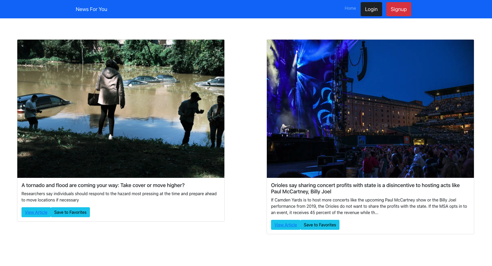
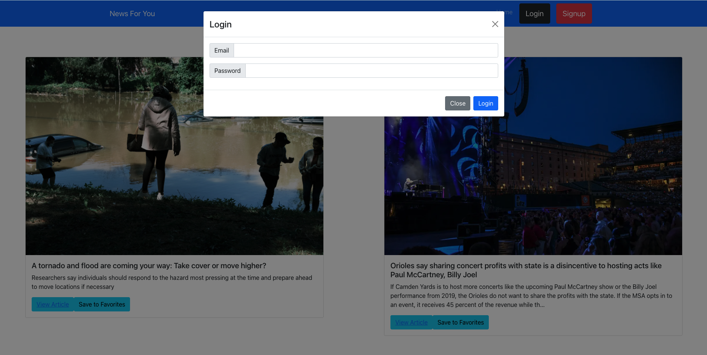
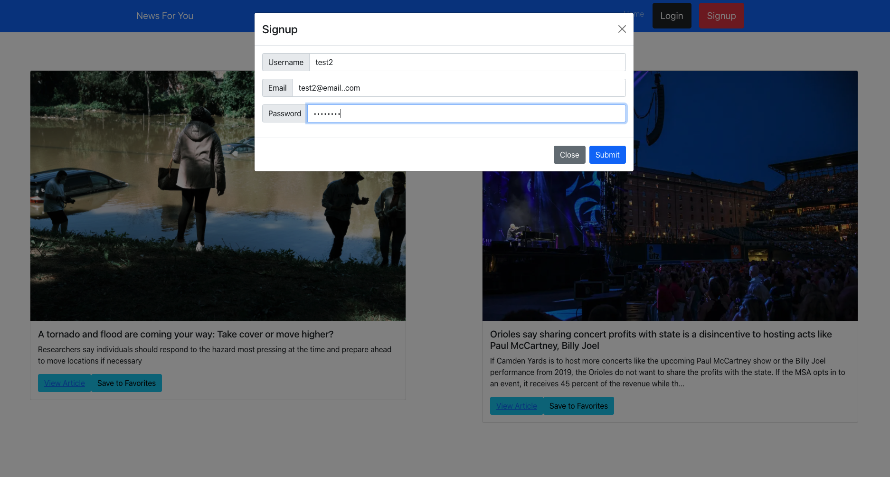
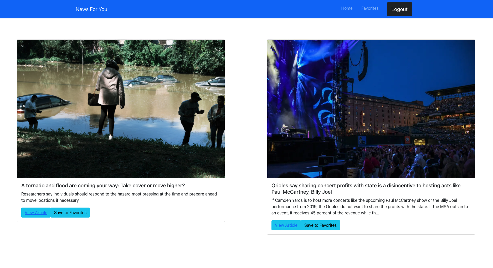
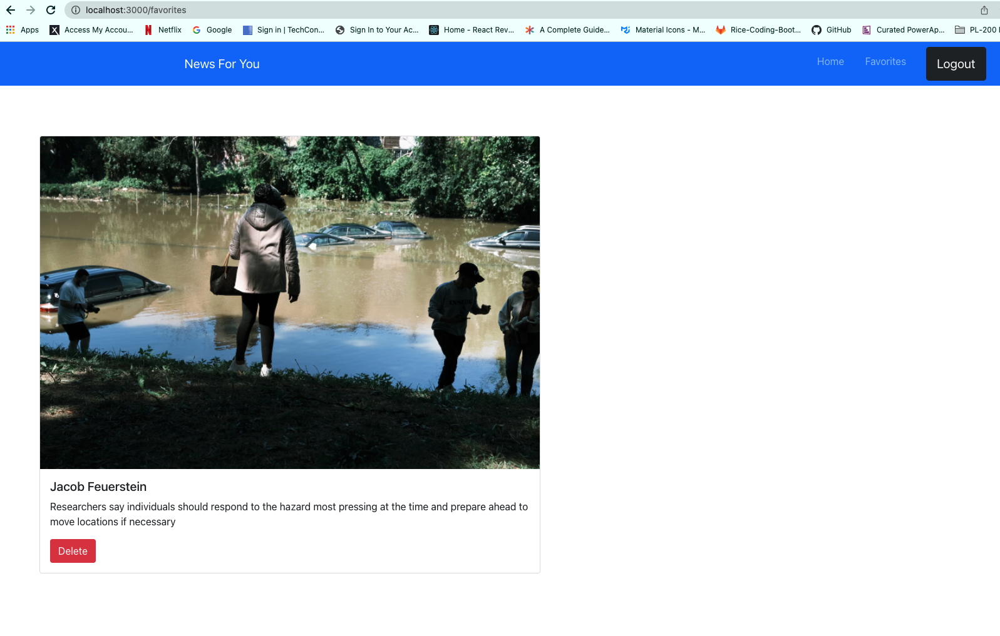

# News For You

## Project Summary

This is a website for reading news articles. News articles will be housed on the website. Then as a user you can create an account, and subscribe to view all of the articles. There will also be publisher accounts that can be created, so that publishers can add new news articles to the website.

## Developers

1. Zane Scheel 

2. Patricia Derieux

## Installation Instructions

- Clone our repo to your computer

- npm install
This should install node modules within the server and the client folder

After both installations are complete, run the following command in your terminal:

- npm start 
Your app should be now running on http://localhost:3000

## Animated Gifs/Pictures of App

## Tech Stack

- MERN

- CSS

- Bootstrap

- JWT

- GraphQL

- Heroku

## APIs

- Stripe

## MVP (Minimum Viable Product)

- As a user

- I want to be able to access the news

- So that I can keep up with current events

## Stretch Goals

- Create different subscription plans for users to access more news articles

- Be able to have publishers accounts

- Give publishers a cut of the money based on how many people view their atrticles
